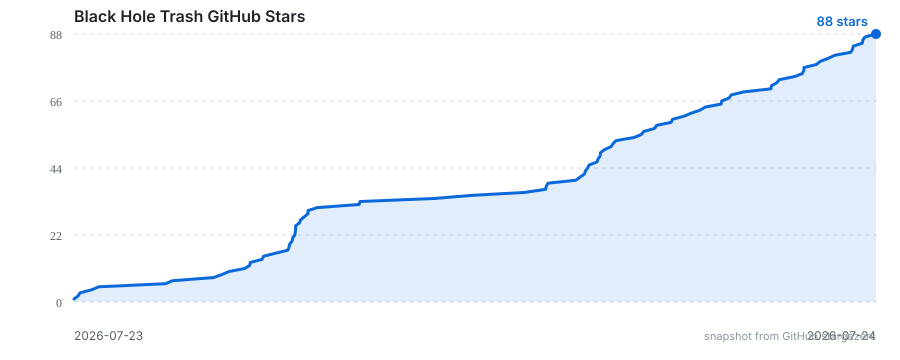
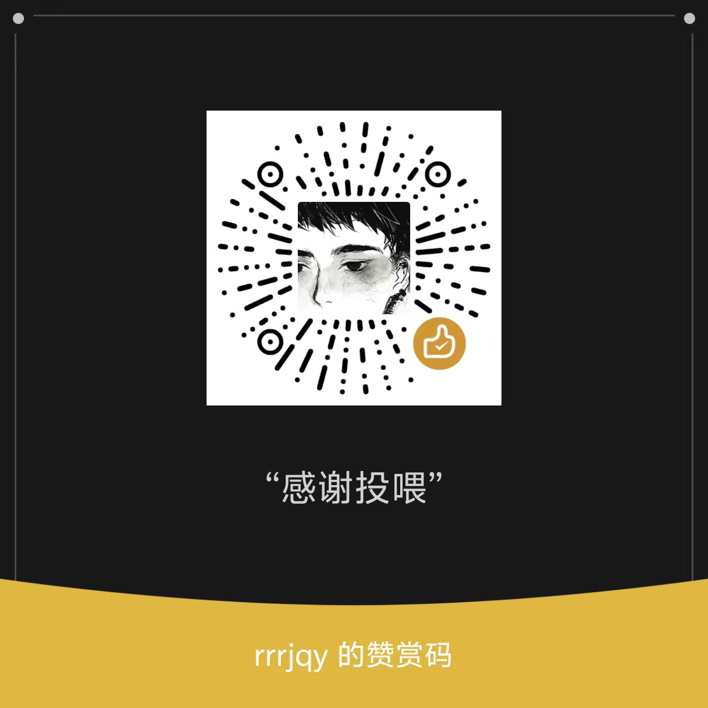

# Black Hole Trash

**简体中文** | [English](README.en.md)

[](https://github.com/ElvisLoo/BlackHoleTrash/releases/latest)
[](https://github.com/ElvisLoo/BlackHoleTrash/stargazers)
[](LICENSE)

Black Hole Trash 是一个小巧、可拖动的 Windows 桌面黑洞，也是一个真正的回收站入口。它用实时引力透镜扭曲桌面，把文件、文件夹或多个项目安全送入 Windows 回收站，而不是永久删除。

## 下载 v1.4.0

[下载 BlackHoleTrash.exe](https://github.com/ElvisLoo/BlackHoleTrash/releases/download/v1.4.0-elvis/BlackHoleTrash.exe) · [查看 Release](https://github.com/ElvisLoo/BlackHoleTrash/releases/tag/v1.4.0-elvis)

macOS 版本可参考并下载：[ZGhey/blackhole-mac](https://github.com/ZGhey/blackhole-mac)。

安装包按当前用户安装，不需要管理员权限。安装包尚未进行代码签名，Windows SmartScreen 可能显示安全提醒；可在同一 Release 页面下载 `.sha256` 文件核对完整性。

## 当前功能

- **真实回收站拖放**：通过 Windows OLE `IDropTarget` 接收文件、文件夹和多项目拖放，使用 `IFileOperation + FOFX_RECYCLEONDELETE` 送入回收站。
- **不会永久删除**：没有 `DeleteFile`、`RemoveDirectory` 或 `std::fs::remove_*` 后备路径。Shell 拒绝或取消时，源文件保持原状。
- **实时引力透镜**：Schwarzschild / Kerr 测地线、事件视界、光子环、相对论吸积盘和黑体辐射实时渲染；开启旋转后，透镜背景与吸积盘会持续转动。
- **8 种外观预设**：Inferno、Gargantua、Quasar、M87* donut、Blazar、Face-on ember、Pure lens、Zen，可从托盘实时切换并平滑过渡。
- **鼠标引力与吸收残影**：光标进入引力场后受到渐进阻力，靠近事件视界时绕转并带着多层方向残影吸收；快速向外甩动可脱离。
- **六档吞噬成长**：吞噬数量达到 `0 / 1 / 3 / 5 / 10 / 20` 个时切换尺寸，最大为初始尺寸的 `4 倍`，每次变化带平滑过渡。
- **吞噬能量反馈**：文件成功进入回收站后，黑洞会发射双向能量喷流、中心闪光和向外扩散的冲击光波，批量吞噬时效果更强。
- **桌面驻留与始终置顶**：默认只在黑洞没有被普通窗口覆盖时显示；托盘可开启“始终置顶”。两种模式都不显示任务栏按钮，只保留托盘图标。
- **中文系统托盘**：始终置顶、外观、大小、速度、帧率、屏幕保护、旋转、位置和显示器等选项均可从托盘调整。
- **固定帧率选项**：托盘只提供 `30 帧` 和 `60 帧`；配置缺失、`0`、无效值或其他数值都会回退到 `30`。
- **实时桌面捕获**：Windows 使用 DX12、`windows-capture` 与 D3D11 → D3D12 共享纹理零拷贝路径，并保留 CPU 后备路径。
- **多显示器漫游**：每台显示器使用独立 Pane，黑洞可跨屏移动，也可从托盘固定到指定显示器。
- **屏幕保护模式**：键盘鼠标空闲指定分钟后出现，首次输入时消失。
- **捕获排除与截图修复**：覆盖窗口不会被自身桌面捕获再次采集，避免无限镜像；全屏 Print Screen 截图可将黑洞合成回剪贴板图像。
- **更新提示**：每天最多检查一次 GitHub Release，并在托盘中提示新版本；可在配置中关闭。

## v1.4.0 新增

- **吞噬冲击光波**：文件成功送入回收站后触发约 `900 ms` 的双向喷流、中心闪光和扩散光环；批量吞噬的能量按数量平滑增强，并在 `20` 个物品时封顶。
- **可见持续旋转**：托盘中的中速、高速和极限旋转现在会持续带动透镜背景与吸积盘纹理，速度逐级提升，方向跟随当前吸积盘；关闭旋转时保持静止并走原有低开销路径。
- **禁止管理员权限启动**：以管理员身份运行时会直接弹窗说明 Windows UIPI 会导致资源管理器拖放失效，并停止启动；正常双击或从开始菜单打开即可。

## v1.3.0 新增

- **默认不置顶**：启动后使用桌面感知模式。普通窗口没有碰到黑洞的圆形可见区域时，黑洞继续显示在旁边露出的桌面上；窗口与该区域相交时，黑洞自动隐藏，窗口移开、最小化或关闭后自动恢复。
- **可选始终置顶**：右键托盘图标并勾选“始终置顶”，黑洞将不再因普通窗口覆盖而隐藏；取消勾选后立即恢复桌面感知模式。
- **只驻留托盘**：无论是否开启始终置顶，Black Hole Trash 都不会创建任务栏按钮。设置和退出入口统一保留在系统托盘。
- **双击 `Ctrl` 放置**：原来的 `Ctrl+Shift` 跟随操作已经移除。在 `350 ms` 内完整按下并松开两次 `Ctrl`，黑洞会移动并固定到当前鼠标位置；长按、组合键或中间按下其他键不会触发。
- **默认 30 帧**：首次启动、未配置帧率或配置值无效时使用 `30 FPS`，仍可从托盘切换为 `60 FPS`。

## v1.2.0 新增

- **六档尺寸**：新增吞噬 `20` 个物品的第六档，尺寸达到初始大小的 `4.00 倍`；前五档为 `1.00 / 1.25 / 1.50 / 1.75 / 2.00 倍`。
- **托盘汉化**：大小、速度、帧率、屏幕保护、旋转、位置和退出等菜单统一为中文。
- **帧率收敛**：帧率选项只保留 `30 帧`、`60 帧`，并移除无限帧分支。

## 使用方法

1. 启动 `BlackHoleTrash.exe`。
2. 按住黑洞并拖动，将它放到需要的位置；也可以双击 `Ctrl` 将黑洞固定到鼠标位置。
3. 从 Windows 文件资源管理器拖入文件、文件夹或多个项目。
4. 在黑洞中心松开鼠标，项目会进入 Windows 回收站。
5. 右键系统托盘图标切换外观、大小、速度、帧率、位置和其他设置。

鼠标吸收动画约持续 160 ms，并在黄圈附近开始收束。吸收不会锁死光标：快速向外甩动会立即脱离引力场；吸收后的系统光标最多隐藏 150 ms，并在下一次物理移动时恢复。拖动黑洞本体时吸附会暂时停用，拖入文件时保持生效。

### 请勿以管理员身份运行

Black Hole Trash 不需要管理员权限。Windows UIPI 会阻止普通权限的文件资源管理器向管理员权限程序拖放文件，因此程序检测到管理员权限后会弹出警告并停止启动。请直接双击 `BlackHoleTrash.exe`，或从开始菜单正常打开；不要选择“以管理员身份运行”。

## 桌面显示模式与操作

- **默认桌面模式**：不需要按 `Win+D`。程序每 `100 ms` 检查一次黑洞是否被普通窗口实际盖住。窗口只占屏幕一部分且位于黑洞旁边时，黑洞继续显示；窗口移动到黑洞上方时自动隐藏，移开后自动恢复。
- **始终置顶模式**：右键托盘图标，点击“始终置顶”。此模式下黑洞保留在普通窗口上方，再次点击即可关闭。
- **放置黑洞**：直接拖动黑洞，或把鼠标移到目标位置后双击 `Ctrl`。双击后会自动切换为固定位置；需要恢复移动时，从托盘的“位置”菜单选择“自动漂移”。
- **托盘与退出**：程序不出现在任务栏中。需要调整设置或退出时，请右键系统托盘中的 Black Hole Trash 图标。

“自动隐藏”会直接停止渲染、文件拖放入口和鼠标引力，不播放 Windows 窗口最小化动画，也不会在任务栏留下按钮。

## 安全规则

程序会在拖入和松手时重复校验路径，并拒绝无法确认能安全回收的项目，包括：

- 网络路径和映射网络盘；
- 移动设备和非固定磁盘；
- 磁盘根目录；
- 已位于 `$Recycle.Bin` 内的项目；
- Windows 系统目录；
- Black Hole Trash 自身及其安装目录；
- 已消失、已变化或无法由 Shell 解析的路径。

如果 Shell 拒绝或取消操作，文件保持原状；程序不会改用永久删除。

## 系统要求

- Windows 10 版本 2004 或更高版本；
- Windows 11；
- x64 桌面环境；
- 支持 DirectX 12 的显卡。

正式版本不需要预先安装 Rust、Node.js 或 Python。

## 配置

配置文件名为 `black-hole-trash.toml`，与可执行文件放在同一目录。配置支持热重载，也可以直接使用托盘菜单调整常用选项。

```toml
# 帧率只接受 30 或 60；缺失、无效值和其他数值回退到 30。
fps = 30

# 0 = 被普通窗口覆盖时隐藏（默认）；1 = 始终置顶。
always_on_top = 0

# 尺寸会吸附到六档：0.011 / 0.01375 / 0.0165 / 0.01925 / 0.022 / 0.044
size = 0.011

# 外观：inferno | gargantua | quasar | m87 | blazar | ember | lens | zen
preset = gargantua
```

完整配置模板可以从托盘菜单打开配置文件后查看。

## 从源码构建

需要安装 [Rust](https://rustup.rs) 的 MSVC 工具链。

```powershell
cargo build --release --bin BlackHoleTrash
cargo test --all-targets
cargo fmt --all -- --check
cargo check --all-targets
```

输出文件为 `target\release\BlackHoleTrash.exe`。WGSL 主着色器位于 `src/black_hole_trash.wgsl`，Windows 拖放与回收逻辑位于 `src/platform/windows/`。

## 平台支持

- **Windows**：主要平台，已覆盖桌面捕获、拖放回收、托盘和安装包流程。
- **macOS**：ScreenCaptureKit 和菜单栏结构已保留，但没有真实 Mac 开发环境，属于未测试状态。
- **Linux**：暂不支持；X11 和 Wayland 没有可靠的窗口捕获排除路径。

## 历史版本

| 版本 | 功能增加 |
| --- | --- |
| **v1.4.0** | 吞噬喷流与冲击光波、可见持续旋转、管理员权限启动拦截。 |
| **v1.3.0** | 默认桌面感知显示、可选始终置顶、仅托盘驻留、双击 `Ctrl` 放置、默认 30 FPS。 |
| **v1.2.0** | 六档吞噬成长（最大 4 倍）、中文托盘、仅 30/60 帧率选项、异常帧率回退策略。 |
| **v1.1.0** | 鼠标引力、渐进阻力、螺旋吸收、方向残影、快速甩动脱离和跨显示器轨迹。 |
| **v1.0.0** | 首个可公开下载的 Windows x64 安装版本，包含实时引力透镜、Explorer 拖放回收、多显示器和托盘预设。 |

## Star History

[](https://www.star-history.com/#ElvisLoo/BlackHoleTrash&Date)

## 项目来源与许可证

Black Hole Trash 基于 [GreenScreen410/singularity](https://github.com/GreenScreen410/singularity) 开发，并保留 MIT 许可证和原作者署名。黑洞概念亦受到 [ghostty-blackhole](https://github.com/s0xDk/ghostty-blackhole) 启发。

MIT，详见 [LICENSE](LICENSE)。

## 交流与投喂

<table>
  <tr>
    <td align="center"><strong>加入 QQ 群</strong><br><br>群号：1083121107</td>
    <td align="center"><strong>投喂支持</strong><br><br>感谢你的支持</td>
  </tr>
</table>

欢迎 Star、提交 Issue 或加入 QQ 群交流。
